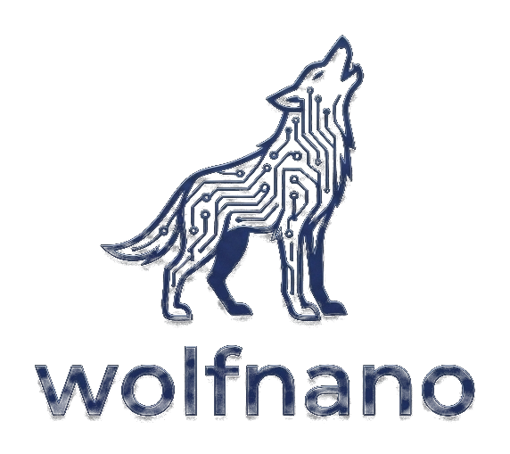

<div align="center">



**A condensed, TLS 1.3-only, zero-allocation embedded TLS library, built as a
thin shell on top of [wolfSSL](https://github.com/wolfSSL/wolfssl).**

[](https://github.com/aidangarske/wolfNanoTLS/actions)
[](LICENSING)
[](https://www.rfc-editor.org/rfc/rfc8446)

</div>

---

wolfNanoTLS is a **behavioral subset of wolfSSL**: the components you want for the
smallest constrained MCUs, assembled into a plain-Makefile project (in the
spirit of wolfCOSE / wolfIP). It consumes wolfSSL as a **pinned git submodule
and never modifies it**, reaching crypto only through a thin `wc_*` provider
seam. It never offers a primitive, group, suite, or extension wolfSSL lacks, so
interop stays identical to wolfSSL.

## Main Features

- **TLS 1.3 only**: client-first, Raw Public Keys (RFC 7250) + PSK by default;
  X.509 is a compile-time adder. No TLS 1.2, no compatibility layer.
- **Zero dynamic allocation**: the product shell and `src` crypto floor run
  entirely on caller-provided / static buffers (`WOLFSSL_NO_MALLOC`), verified
  with a malloc trap. Nothing on the heap.
- **Tiny footprint**: a complete Cortex-M33 TLS 1.3 PSK + ECDHE client is
  **34.5 KB** of `.text` (P-256) or **26.9 KB** (X25519) - **~33% smaller than a
  hard-minimized mbedTLS**, and smaller still against a stock mbedTLS (~80 KB).
  The slim shell itself is ~8.7 KB vs wolfSSL's TLS layer at ~52 KB.
- **Full wolfSSL asm speed**: target assembly is linked unchanged from the
  submodule. On x86_64, AES-128-GCM hits **2.7 GB/s** and ECDSA P-256 verify
  **~72x** MbedTLS, with none of wolfSSL's configure surface.
- **Post-quantum ready**: ML-KEM-768 (+ X25519MLKEM768 hybrid) and ML-DSA are
  compile-out-able adders.
- **Per-algorithm compile flags** (`WOLFNANOTLS_HAVE_*`): every algorithm and
  feature is behind one switch; off means no undefined references.
- **Path to FIPS**: a `WOLFNANOTLS_CRYPTO=fips` build links a customer-supplied
  validated wolfCrypt bundle under the byte-identical shell (TLS layer is
  outside the boundary).

## Supported Algorithms

**Key exchange:** `ECDHE P-256/P-384, X25519, ML-KEM-768, X25519MLKEM768 (hybrid)`

**Signatures:** `ECDSA P-256/P-384, Ed25519, RSA-PSS (verify), ML-DSA (verify)`

**AEAD:** `AES-128/256-GCM, ChaCha20-Poly1305`

**Hash / KDF:** `SHA-256, SHA-384, SHA3-256, HMAC, HKDF`

The offered cipher-suite and group lists are a function of the active backend,
so a `fips` build never advertises a primitive outside its boundary.

## Footprint (Cortex-M33, measured)

Whole TLS 1.3 client linked from source for Cortex-M33 (AES-128-GCM, SHA-256),
`arm-none-eabi-gcc -Os -flto --gc-sections` + nano specs, with wolfNanoTLS and
mbedTLS 3.6 **both hard-minimized to the identical scope** (minimal PSA
`PSA_WANT_*` config, no SHA-3, no restartable ECP, one curve). `.text`:

| Client | wolfNanoTLS | mbedTLS (hard-min) | full wolfSSL | smaller by |
|---|--:|--:|--:|--:|
| PSK + ECDHE, **P-256** | **34.5 KB** | 51.8 KB | - | 33% |
| PSK + ECDHE, X25519 | **26.9 KB** | 41.1 KB | - | 34% |
| cert / X.509, P-256 | **59.6 KB** | 98.9 KB | 147.4 KB | 40% |

This is the **conservative like-for-like** figure. mbedTLS's stock PSA config
(RSA, SHA-1/3, Camellia, DES, ChaCha, restartable ECP...) builds the same PSK
client at ~80 KB, so against a typical mbedTLS the gap is larger; wolfNanoTLS quotes
the hard-minimized number because it is the fair one.

Reproduce with `sh bench/footprint-clients.sh`; the exact configs are
`bench/min/mbedtls_config_psk_hardmin.h` + `bench/min/mbedtls_crypto_config_psk.h`
(mbedTLS) and `bench/min/wnc/user_settings.h` (wolfNanoTLS). Both harness clients
use opaque I/O stubs so LTO cannot dead-strip the handshake (which would
understate either side). See
[Footprint](https://github.com/aidangarske/wolfNanoTLS/wiki/Footprint).

## Speed (x86_64, vs MbedTLS, same host)

wolfNanoTLS's `intel` build (wolfCrypt asm through the seam) vs MbedTLS 3.6.0 fast
config, both `-O2 -march=native`:

| Operation | wolfNanoTLS | MbedTLS | faster |
|---|--:|--:|--:|
| AES-128-GCM | 1682 MiB/s | 119 MiB/s | ~14x |
| ECDSA P-256 verify | 9386 op/s | 130 op/s | ~72x |
| ECDSA P-256 sign | 20799 op/s | 721 op/s | ~29x |
| ECDH P-256 agree | 9472 op/s | 390 op/s | ~24x |

Plus a full PQC + EdDSA suite MbedTLS does not have. See
[Benchmarks](https://github.com/aidangarske/wolfNanoTLS/wiki/Benchmarks).

## Status

Early development, but functional. The wolfNanoTLS TLS 1.3 client completes a
**live PSK + ECDHE handshake against both OpenSSL and wolfSSL**; the crypto
floor is validated by RFC-vector KATs and wolfSSL's own crypto test, true
no-allocation is verified, and side-channel hardening is on. PQC, X.509, and the
FIPS backend are wired and proven; the handshake state machine continues to
fill in.

## Build

```sh
git clone --recursive https://github.com/aidangarske/wolfNanoTLS.git
cd wolfNanoTLS
make test        # build + run all suites
make interop     # live TLS 1.3 handshake vs OpenSSL / wolfSSL
make bench       # all-algo speed table (portable C vs Intel asm)
```

| Target | Description |
|---|---|
| `make test` | Build and run all unit / KAT suites |
| `make interop` | Live handshake vs OpenSSL, wolfSSL, MbedTLS |
| `make bench` | All-algo benchmark, `WOLFNANOTLS_ASM=none` vs `=intel` |
| `make targets` | Cross-compile the floor for every `WOLFNANOTLS_ASM` arch |
| `make fipsproof` | Build the shell against a wolfCrypt FIPS bundle |
| `make clean` | Remove build artifacts |

Pick the accelerated backend with `WOLFNANOTLS_ASM=intel|thumb2|aarch64|armv7|riscv64`
(default `none` is portable C). See
[Macros](https://github.com/aidangarske/wolfNanoTLS/wiki/Macros).

## CI / Testing

Runs on every push and PR:

- **Build + Test**: Ubuntu + macOS, GCC + Clang, against the pinned, latest
  stable, and master wolfSSL submodule
- **Standards**: house style, no bare-scope braces, C89 `-Werror`, the
  zero-allocation grep
- **Static analysis**: Semgrep, cppcheck, codespell
- **Sanitizers**: ASAN / UBSAN
- **Nightly**: coverage, stack bounds, Coverity, footprint + speed vs MbedTLS,
  and a green-gated auto-bump of the wolfSSL pin to a known-good master

See [CI](https://github.com/aidangarske/wolfNanoTLS/wiki/CI).

## Documentation

Full documentation lives in the
[Wiki](https://github.com/aidangarske/wolfNanoTLS/wiki):

- [Getting Started](https://github.com/aidangarske/wolfNanoTLS/wiki/Getting-Started)
- [Architecture](https://github.com/aidangarske/wolfNanoTLS/wiki/Architecture)
- [Algorithms](https://github.com/aidangarske/wolfNanoTLS/wiki/Algorithms)
- [Macros](https://github.com/aidangarske/wolfNanoTLS/wiki/Macros)
- [Footprint](https://github.com/aidangarske/wolfNanoTLS/wiki/Footprint)
- [Benchmarks](https://github.com/aidangarske/wolfNanoTLS/wiki/Benchmarks)
- [FIPS](https://github.com/aidangarske/wolfNanoTLS/wiki/FIPS)
- [Testing](https://github.com/aidangarske/wolfNanoTLS/wiki/Testing)
- [CI](https://github.com/aidangarske/wolfNanoTLS/wiki/CI)
- [Positioning](https://github.com/aidangarske/wolfNanoTLS/wiki/Positioning)

## License

wolfNanoTLS is free software licensed under
[GPLv3](https://www.gnu.org/licenses/gpl-3.0.html); see [LICENSING](LICENSING)
and [COPYING](COPYING). The `fips` build path is not GPLv3-only.

Copyright (C) 2006-2026 wolfSSL Inc.

## Support

For commercial licensing or support, contact
[wolfSSL](https://www.wolfssl.com/contact/).
